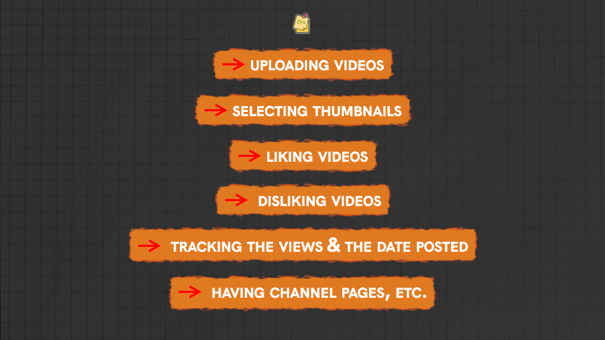

# YouTube Clone built with Django

This project aims to replicate a simpler version of YouTube using the [Django Framework](https://docs.djangoproject.com/en) in [Python](https://www.python.org).

## Features

All the planned features can be seen in the following image:

- Uploading Videos
- Selecting Thumbnails
- Linking Videos
- Disliking Videos
- Tracking the views & the date posted
- Having channel pages, etc.

## Disclaimer

The following project is based on the following Tech with Tim's video: [Django FULL Project Build - YouTube Clone | ImageKit, Authentication, Uploads, & More...](https://youtu.be/_SgRXhguJRM?si=9pSKMfI_KKzpbo3z)

